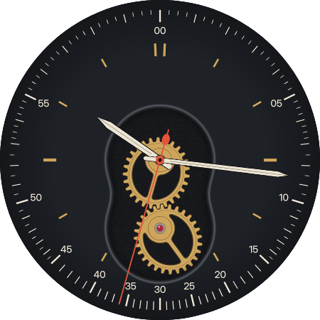
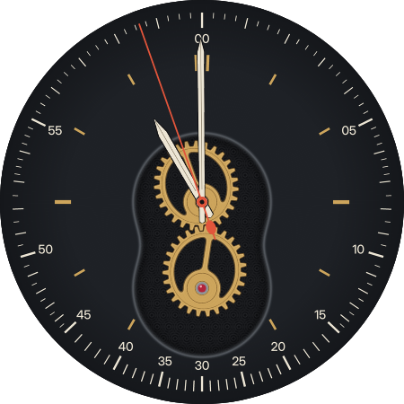
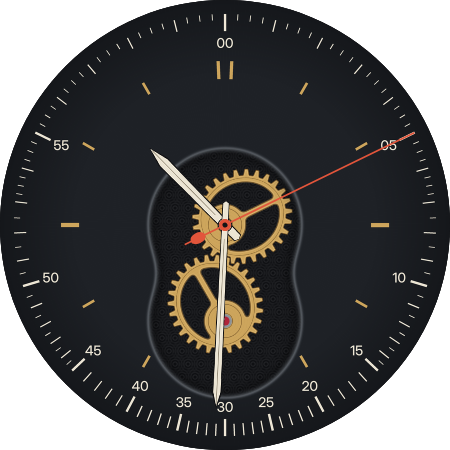
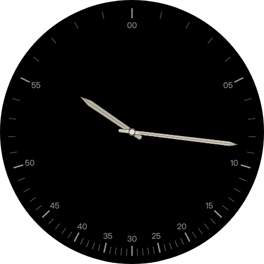

# Non-Circular Gears

Patrick's brief (October 2026): two elliptical gears turn in a window. The
minute and second hands speed up through the top of the dial and slow down at
the bottom, and the minute scale is spaced to match, so every reading is still
exact. The gears are shown linked to the hands.

## Mechanism

Two identical elliptical gears are each pivoted at a focus, one major axis
(96 units) apart. Their focal radii always add up to that distance, so they
roll on each other without slipping and both make one turn per turn.

- **Driver.** The lower gear, pivoted toward 6 o'clock under a ruby jewel. It
  turns uniformly once a minute, counter-clockwise.
- **Follower.** The upper gear sits on the hand arbor at the centre of the
  dial and carries the second hand. Its long side always points along the
  hand. At :00 its short side meets the driver's long side, so it runs
  (1+e)/(1−e) = 2.33× the average speed. At :30 the long side meets the short
  one and it runs 0.43× the average.

For a uniform driver angle `u` the follower angle is

    g(u) = u + 2·atan(e·sin u / (1 − e·cos u)),   e = 0.4

The denominator never reaches zero, so the expression is continuous through
the whole turn and needs no branch.

## Dial

- **Minute scale.** Mark *m* is drawn at `g(6m)`, so the hand for m:00 lands
  on mark *m*. The scale is 13.9° per minute at 12 and 2.6° at 6. Quarter
  minutes are marked where a minute spans more than 9°, half minutes where it
  spans more than 4.5°. The tick density shows the law.
- **Second hand.** `g(6s)` with milliseconds, a red needle fixed to the
  follower. It shares the minute scale.
- **Minute hand.** The same law once an hour, `g(6·(minute + second/60))`.
- **Hour hand.** Uniform, read against brass batons on their own ring. 6 is
  left to the driver's arbor and 12 is doubled.
- **Ambient.** Black, with the stretched scale, numerals, and the hour and
  minute hands. The movement, plate and second hand are hidden.

## Source and validation

`geometry.py` holds the law and dimensions. `generate_assets.py` renders the
gear (one PNG, 27 teeth spaced by equal arc length, a tooth on the short
side so it meets a gap on the long side), the dial plate with the window cut
out, the movement, the ambient dial and the hands. `generate_xml.py` writes
`watchface.xml`. Regenerate with:

    python3 faces/non-circular-gears/generate_assets.py
    python3 faces/non-circular-gears/generate_xml.py
    python3 faces/non-circular-gears/test_gears.py

`test_gears.py` checks that the pitch curves touch on the line of centres at
every angle, that equal arc lengths pass the contact point on both gears, the
speed extremes, that each scale mark is where the hands read, and that the
XML expression evaluates to the same law.

The XML validates against the official WFF v4 XSD (github.com/google/watchface,
read as XSD 1.1). Group and Part `x`/`y`/`width`/`height` must be integers, so
the gear image is 146 units square (focus at its centre) and the hand images
are whole units wide. A raster check of both gear bitmaps every 2.5° of driver
angle found no tooth overlap anywhere in the turn, and the teeth interleave at
the fast and slow ends.

## Previews

`preview.png` and `previews/` are WFF Web renders of the canonical XML
(vendored `preview/vendor/wff-web.js`, headless Chromium).

The face uses `atan`, `sin`, `cos`, `deg` and `rad` in transforms (Sundial II
uses `sin`/`cos`/`rad` on device; `atan` and `deg` are standard WFF functions
not yet used by another face here) and Group rotations about off-centre pivots.
It stays `draft` until checked on the watch.
