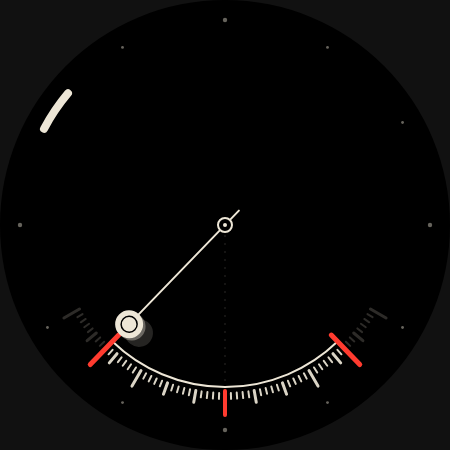
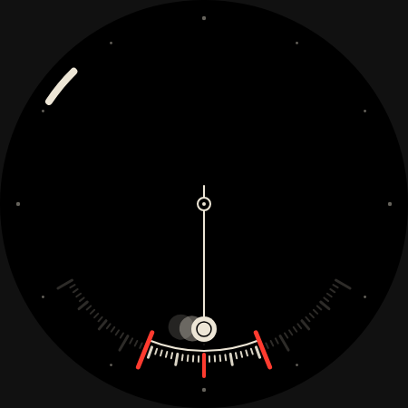
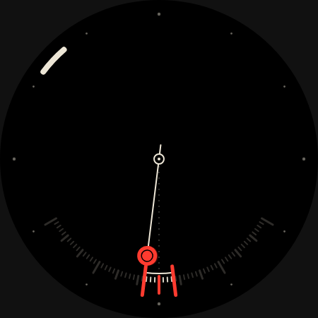
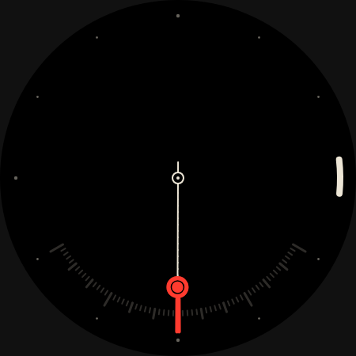
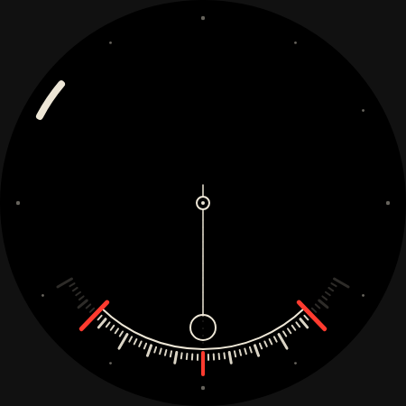

# Pendulum

A watch face for knowing when the next meeting starts, without reading a number.

## October 2026 reimagining

The original face swung a vertical line across the dial on a 60-minute sine. It
crossed the centre at :00 and :30, and a dashed line glowed as it got near. The
line was in the same place at :10 and :20, so a trail had to show the direction.

This version makes the closing window literal and one-directional.

- **The pendulum runs down.** A seconds pendulum hangs from the dial centre and
  beats once per second (2 s period, at the extremes on each tick). Its swing equals the
  minutes left until the next :00 or :30, at two degrees per minute. It swings
  ±60° just after the half hour and hangs plumb when the meeting starts. Then the
  window snaps open again.
- **The gates** are two red bars on the minute scale at ±(minutes left). They show the
  window without waiting for a swing, and also show in ambient.
- **Minute scale.** One tick per minute either side of the centre, longer at 5,
  longer still at 15. Ticks outside the window go dark as it closes, so the lit ticks count down.
- **Final five minutes.** The bob turns red, and the dashed plumb line brightens as the
  gates converge on the red centre mark.
- **Hour.** A bone bar on the bezel track, moving continuously through the hour.
- **Ambient.** No motion. The pendulum hangs at rest as an outline, and the
  gates, lit window and hour bar stay.

Bone (#EDE6D6) and red (#FF3B2F) on black. No numerals.

## Source and validation

`watchface.xml` is generated by `generate_xml.py`. Edit the generator, then run
`python3 faces/pendulum/generate_xml.py`. The XML validates against the official
WFF v4 XSD (github.com/google/watchface). The original's `dashIntervals="3,6"` was
not valid; the list is space-separated. Previews and `preview.png` are WFF Web
renders of the canonical XML.

The face uses only constructs already proven on a Pixel Watch by Radial Moiré and
Book of Hours: Group angle transforms, Group `Variant` alpha for ambient,
PartDraw alpha transforms, Arc start/end angle transforms, `cos()`, and
`[SECONDS_SINCE_EPOCH]` + `[MILLISECOND]`. It stays `draft` until it has been checked
on the watch. Things to check there: how smooth the swing is, the battery cost of continuous
animation, and whether `[MINUTE_SECOND]` advances per second on the device.
