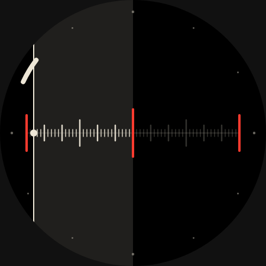
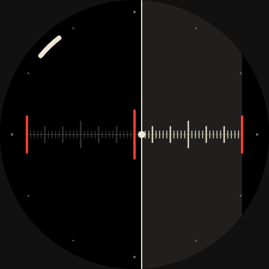
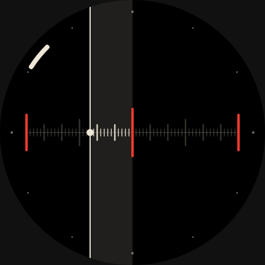
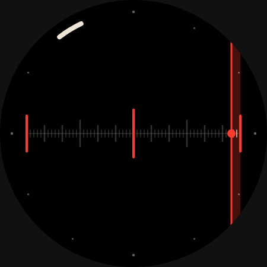

# Pendulum

A watch face for knowing when the next meeting starts, without reading a number.

## October 2026: linear sweep

The first version swung a line on a 60-minute sine, centred at :00 and :30. A
pendulum rework followed, with its swing equal to the minutes left. Patrick
pointed out that in both, :02 and :32 (and every pair 30 minutes apart) looked
identical. He asked for a linear sweep instead of a pendulum.

The face is now a single timeline for the hour:

- **The sweep.** A full-height line with a bead on the minute track moves left to
  right at a constant 6 units per minute. :00 is the left edge, :30 the centre
  and :00 again the right edge. It only travels one way, so no two minutes of
  the hour share a position. At the top of the hour it jumps from the right edge
  back to the left.
- **Meeting marks.** Red bars at both edges (:00) and a taller one at the centre (:30).
- **The closing window.** A faint band from the line to the next meeting mark.
  It narrows to nothing at :00 and :30, then reopens across the next half hour.
- **Minute track.** One tick per minute, longer at 5 and 15. Ticks still ahead
  of the line in the current half hour are lit and the rest are dim.
- **Final five minutes.** The line, the bead and the window turn red.
- **Hour.** A bone bar on the bezel track.
- **Ambient.** The window band is hidden and the line, track and hour bar stay.

The slug and name remain `pendulum` so existing links and installs keep working.

WFF Web does not apply the round clip, so the band and line run past the circle
in these renders. The Pixel Watch display clips them.

## Source and validation

`watchface.xml` is generated by `generate_xml.py`. Edit the generator, then run
`python3 faces/pendulum/generate_xml.py`. The XML validates against the official
WFF v4 XSD (github.com/google/watchface). The original's `dashIntervals="3,6"` was
not valid; the list is space-separated. Previews and `preview.png` are WFF Web
renders of the canonical XML.

The face uses only constructs already proven on a Pixel Watch: Group `Variant`
alpha for ambient, PartDraw alpha transforms, shape size and position transforms
(Split-Flap), and Arc start/end angle transforms (Book of Hours). It stays `draft` until it
has been checked on the watch.
