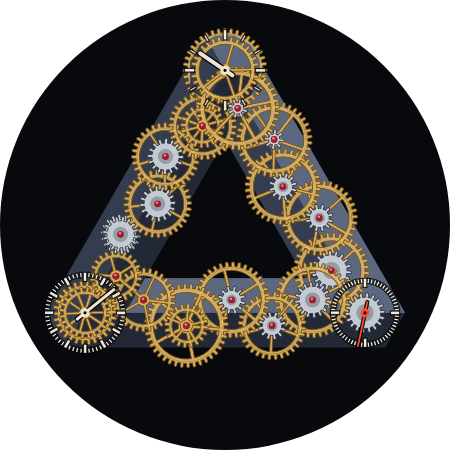
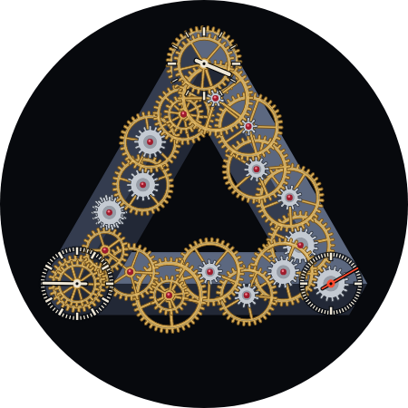
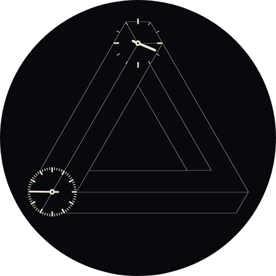

# Penrose Gear Train

The gears are impossible, but correctly ratio'd.

## The mechanism

Eighteen arbors and 33 gears run in a closed loop around a Penrose tribar.
Hours sit on the top corner, seconds on the bottom right, minutes on the
bottom left. Each mesh uses a real tooth count at module 2.0, and each pair of
meshing gears sits exactly the sum of their pitch radii apart. Every arbor
turns at the rate its tooth counts force on it:

| Beam | Path | Meshes (driver → driven) | Ratio |
| --- | --- | --- | --- |
| Right | hours → seconds | 32→8, 40→8, 36→12, 36→12, 36→18, 36→18 | ×4 ×5 ×3 ×3 ×2 ×2 = ×720 |
| Bottom | seconds → minutes | 18→36, 16→32, 12→36, 12→40, 20→30 (idler) →30 | ÷2 ÷2 ÷3 ÷10/3 ÷3/2 = ÷60 |
| Left | minutes → hours | 24→24 (idler) →18, 16→32, 16→32, 16→32, 20→40 | ×4/3 ÷2 ÷2 ÷2 ÷2 = ÷12 |

The tooth ratios around the loop multiply to exactly one, so the train is
self-consistent: ×720 up one beam is undone by ÷60 and ÷12 down the other two.
Each beam has six meshes, so all three corner arbors turn clockwise. The
idlers are there for spacing and direction. Every arbor's period divides
twelve hours (60 s for seconds, up to 43,200 s for hours), so nothing jumps
when the cycle wraps.

`generate_xml.py` derives the rates from the tooth counts and asserts that the
loop closes. It then places each arbor at its exact centre distance in a
shallow zigzag along its beam, and rotates each gear image so its teeth land
in its neighbour's gaps. That phase holds at all times because the rates are
exact. `test_train.py` evaluates the Transform expressions in the generated
XML and checks the ratios, the centre distances, the hand readings, and that
every mesh stays within a sixth of a tooth over random times and across the
12-hour wrap.

## The impossible part

The tribar is built from isometric voxels: n cubes along +x, then +y, then +z.
The path ends one cube short of where it began. Because (1,1,1) projects to a
point, the last bar appears to meet the first, and painting the first cube
last makes the join impossible.

The gears follow the same trick. Along each beam they stack the way a real
movement would: each pinion sits on its own wheel, and the driven arbor's
wheel lies under the wheel that drives it, so every mesh is in view. At the
top corner, the left beam's gears and the hour arbor's lower wheel pass behind
the corner block. The hour arbor's upper wheel and the right beam's first
arbor sit in front of it. The hour arbor runs through solid tribar.

An earlier draft drew the stack as an endless staircase, with each gear over
the one before all the way around and a mask closing the loop. On the right
beam that buried every pinion under its own wheel, which hid the meshes, so
it was dropped.

## Reading it

Bone hands on fixed tick rings: 12 ticks for hours, 60 for minutes and
seconds. The seconds hand is red. Only the seconds end of the train visibly
moves. The two arbors next to seconds turn once every two minutes, and the
hour wheels effectively stand still.

Ambient hides the movement and shows the tribar in outline with the hour and
minute hands. The seconds hand and its ring are hidden.

## Performance

Arbors with periods of 240 s or less (seconds and the four arbors next to it)
read `[MILLISECOND]` and animate every frame. The other arbors use whole
seconds. The worst lag between neighbours is about a tenth of a tooth.

## Source and validation

Edit the generator, then run `python3 faces/penrose-gear-train/generate_xml.py`
and `python3 faces/penrose-gear-train/test_train.py`. All PNGs in `assets/`
are generated: the tribar, its top corner block, its ambient outline, the tick
rings, and one image per gear. The face uses constructs already used on the
watch by other faces: rotating Groups with PartImage, Group alpha Variants for
ambient, and PartDraw lines and ellipses. It stays `draft` until it has been
checked on a Pixel Watch, especially frame rate with five smoothly animated
arbors.

Previews are WFF Web renders of the canonical XML.

