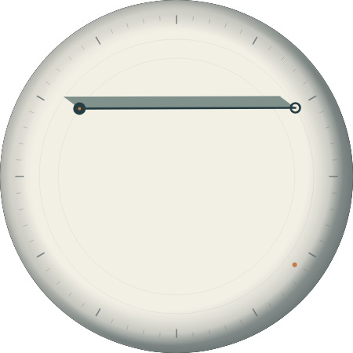
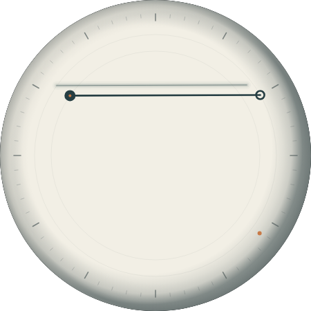
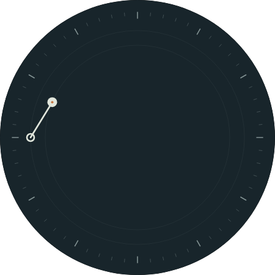
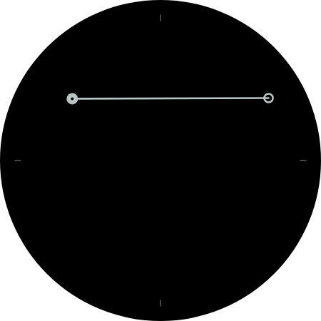

# Sundial II

The watch is a **solar-shadow chord clock**: the two places where conventional
hour and minute hands would terminate are connected by the top of a raised wall.
The line carries civil time; its cast shadow carries the day.

Patrick's October 2026 direction replaces the original Sundial's disconnected
minute dot, rotated hour line, arbitrary noon tilt, and decorative metal case.
This is a new face; the original remains available for comparison.

## Reading the dial

- The filled bead on the inner orbit (radius 110) is the hour; it advances between hours.
- The open ring on the outer orbit (radius 186, just inside the ticks) is the minute;
  each small outer tick is a minute. The wide gap between orbits makes the two ends
  of the chord easy to tell apart.
- The chord joins the centers of both markers. Unequal radii keep it visible at
  12:00 and other hand overlaps, without division by chord length or angle jumps.
- The tiny copper dot orbiting outside the ticks indicates the solar bearing.
- Ivory becomes blue through twilight; the shadow disappears below the horizon.
- Ambient mode shows the same time geometry on black, with four orientation ticks.
- **Shadow geometry** in the watch face editor selects **Floating line** or
  **Raised wall** (default). The web preview exposes the same choices.

The rim curves down into a recessed dial. A narrow radial shade gives the bowl
depth; the crown/rim casts an additional soft inner shadow toward the dial on
the sun-facing side, with restrained reflected light opposite it. These
directional gradients translate with the same east/north/up Sun vector as the
chord, and fade below the horizon. Night retains only subtle static bowl shading.
The entire bowl is disabled in ambient mode. This models the enclosing rim,
rather than drawing an external case or a physical side-button crown.

## Light model

Alameda is fixed at 37.7652° N, 122.2416° W. North is the top of the dial, east
the right. This is a conceptual horizontal dial, not a compass or wrist tilt model.
The civil time markers follow the device timezone. The Sun always follows Alameda
at the same UTC instant, including while traveling and across DST changes.

The solar calculation follows [USNO's approximate solar coordinates](https://aa.usno.navy.mil/faq/sun_approx).
Days since J2000 determine solar longitude and obliquity. The equatorial Sun vector
is rotated by local sidereal angle and latitude to get east, north, and up without
an `atan2` function or quadrant discontinuities. The sidereal expression uses
280.46061837 + 360.98564736629 × days, plus the east-positive longitude.

For an imagined wall sixteen design units above the surface, the screen shadow
translation is `(-16 × east / up, +16 × north / up)`. Elevation changes length;
azimuth changes direction. The denominator is clamped to 0.49 (shadows of at most
~33 units) so a shadow cast from the outer minute ring stays inside the round screen. Opacity fades between 0° and ~4° solar
elevation. There is no moonlight or fictional nighttime Sun shadow. The solid
shadow fills the parallelogram between the chord and its projected edge, with
a crisp far boundary. It stays attached to the wall instead of floating apart.
No terrain, weather, atmospheric refraction, or live location is modeled.

Patrick's follow-up asked for more depth and a solid shadow as though the chord
were a wall. The wall height is doubled from the first version. WFF has no polygon
or shear primitive, so the solid shadow is the chord swept along the shadow vector:
thirteen overlapping opaque copies of the chord, evenly spaced from the chord to the
far edge. Their spacing never exceeds the stroke width, so the parallelogram is solid,
and the sweep naturally narrows when sunlight runs parallel to the wall.

## Pixel Watch rendering constraints

The first promoted build rendered on the watch with **no shadows or rim shading**,
although the dial colour and sun dot (which share the solar math) were correct.
Everything missing used constructs no other installed face used: a ~31,000-character
SVD rotation/scale expression for the solid shadow, a shadow-style `ListConfiguration`
nested inside a `Group`, `Group` alpha fades driven by expressions, and a
`RadialGradient` rim on a `PartDraw` at negative coordinates. The face now uses
only primitives proven on the watch: the style selection sits directly under
`Scene` (as in Radial Moiré), fades are `PartDraw` alpha transforms (as on the sun
dot), the rim is nested stroked ellipses whose alphas compound to the original
gradient stops, and no expression exceeds 5,000 characters (a regression test
enforces this). WFF Web renders it identically to the earlier version.

## Canonical source and validation

`watchface.xml` remains the only runtime definition. `generate_xml.py` is an authoring
helper that expands the shared solar expressions into valid WFF attributes; it
does not run on the watch or implement a separate browser face. Regenerate with
`python3 faces/sundial-ii/generate_xml.py`.

Promoted at Patrick’s request for installation and physical Pixel Watch testing.
CI must pass official APK validation before publication. Preview the canonical
XML through the existing WFF Web site; package with
`./gradlew :watchface:assembleDebug -PfaceSlug=sundial-ii`.

The WFF v4 XSD passes. Six regression tests cover canonical regeneration,
every minute of a full day, endpoint/marker alignment, shadow bounds, nighttime
visibility, and independent NOAA solar comparisons across seasons, leap day,
year rollover, and both DST changes. Solid-shadow corner checks cover another
618 positions across equinox, summer, and winter. Rim translation is also checked
against the independent solar calculation. CI builds, signs, and validates this
face alongside the other promoted faces, then includes it in the installation catalog.

Local Gradle compilation was blocked by unavailable network access to the Gradle
distribution host. Nine canonical-XML WFF Web renders were inspected, including
summer, winter, and both shadow options. The preview UI was verified to switch
the two options, show their proper names, and render ambient mode on black.
These are actual renderer output, not design mockups:

## Wrist-tilt shadow

While the screen is interactive, tilting the wrist swings the cast shadow; the
hour and minute markers, the chord, the sun dot and the scale stay fixed.
`Gyro` offsets driven by `[ACCELEROMETER_ANGLE_X]` and `[ACCELEROMETER_ANGLE_Y]`
(0.3 units per degree, clamped at ±40°, up to ~12 units per axis) move the far
edge of the shadow. With **Raised wall**, each of the thirteen shadow layers takes
its fraction of that offset, so the near edge stays attached to the chord and the
parallelogram shears; with **Floating line**, the whole line shadow shifts.
Ambient mode has no Gyro. At extreme tilt with the longest shadows, the far edge
can slip under the rim.

This is a visual effect only. Watch Face Format exposes tilt but no compass
heading, so the Sun's direction still assumes north is dial-up. Gyro does not run
in WFF Web, so judge it on the watch; `TILT_SIGN_X`/`TILT_SIGN_Y` in
`generate_xml.py` flip an axis if the shadow moves the wrong way.

The face validates against the official WFF v4 XSD from github.com/google/watchface.

## Picker thumbnail

`preview.png` is the 450×450 picker thumbnail, rendered with WFF Web from the
canonical XML with the default Raised wall option at 2026-10-05 10:10 PDT. The
Android build stages it as the `WatchFaceInfo` preview. Without it, the shared
shape placeholder made long-pressing the face hang at "Starting" on a Pixel Watch,
as Radial Moiré did before it gained a bitmap preview. Regenerate it after changing
the default appearance. (WFF Web renders some dates, e.g. 2026-03-13, as night even
though the face's solar math and NOAA agree the Sun is up; pick a render that shows day.)
